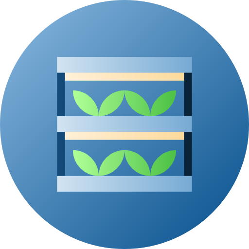

<!-- PROJECT SHIELDS -->
<!--
*** I'm using markdown "reference style" links for readability.
*** Reference links are enclosed in brackets [ ] instead of parentheses ( ).
*** See the bottom of this document for the declaration of the reference variables
*** for contributors-url, forks-url, etc. This is an optional, concise syntax you may use.
*** https://www.markdownguide.org/basic-syntax/#reference-style-links
-->
[![Contributors][contributors-shield]][contributors-url]
[![Forks][forks-shield]][forks-url]
[![Stargazers][stars-shield]][stars-url]
[![Issues][issues-shield]][issues-url]
[![MIT License][license-shield]][license-url]
[![LinkedIn][linkedin-shield]][linkedin-url]


<!-- PROJECT LOGO -->
<br />
<p align="center">
  <a href="https://github.com/Javier-ppp/Vertical-Farm-sensing-and-control">
    
  </a>

  <h3 align="center">Vertical farm sensing and control (IoT)</h3>

  <p align="center">
    <br />
    <a href="https://github.com/Javier-ppp/Vertical-Farm-sensing-and-control"><strong>Explore the docs »</strong></a>
    <br />
    <br />
    <a href="https://github.com/Javier-ppp/Vertical-Farm-sensing-and-control">View Demo</a>
    ·
    <a href="https://github.com/Javier-ppp/Vertical-Farm-sensing-and-control/issues">Report Bug</a>
    ·
    <a href="https://github.com/Javier-ppp/Vertical-Farm-sensing-and-control/issues">Request Feature</a>
  </p>
</p>


<!-- TABLE OF CONTENTS -->
<details open="open">
  <summary>Table of Contents</summary>
  <ol>
    <li>
      <a href="#about-the-project">About The Project</a>
      <ul>
        <li><a href="#Photos Of The Project">Photos Of The Project </a></li>
      </ul>
    </li>
    <li>
      <a href="#getting-started">Getting Started</a>
      <ul>
        <li><a href="#prerequisites">Prerequisites</a></li>
        <li><a href="#installation">Code</a></li>
      </ul>
    </li>
    <li><a href="#usage">Usage</a></li>
    <li><a href="#contributing">Contributing</a></li>
    <li><a href="#license">License</a></li>
    <li><a href="#contact">Contact</a></li>
    <li><a href="#acknowledgements">Acknowledgements</a></li>
  </ol>
</details>


<!-- ABOUT THE PROJECT -->
## About The Project

<!-- [![Product Name Screen Shot][product-screenshot]](https://example.com)-->
The project was done in the framwork of a MSc thesis at Skoltech for energy consumption optimisation in indoor farming industry. The repository includes: 

* the scheme of the sensors based on ESP32 and ESP32CAM
* The code for the boards and server-side
* A list of components and recommendations.

### Photos Of The Project


<!-- GETTING STARTED -->
## Getting Started
The project requires the instalation of Arduino IDE , Moquito MQTT broker, and Node-RED, the last two on the Raspberri Pi.

### Prerequisites
#### List of elements 

#### Software
* The project requires the instalation of arduino IDE, include the ESP32 board a guide on how to do so can be found in [https://randomnerdtutorials.com/installing-the-esp32-board-in-arduino-ide-windows-instructions/](https://randomnerdtutorials.com/installing-the-esp32-board-in-arduino-ide-windows-instructions/) 
* download the libraries WIFI, PubSubClient, OneWire, DallasTemperature ( the last two may change depending on the sensors). a guide on how to do so can be found in [https://www.arduino.cc/en/guide/libraries](https://www.arduino.cc/en/guide/libraries) 
* On the Raspberry Pi install Node-RED,  a guide on how to do so can be found in [https://nodered.org/docs/getting-started/raspberrypi](https://nodered.org/docs/getting-started/raspberrypi)
*  On the Raspberry Pi installMosquito MQTT broker,  a guide on how to do so can be found in https://randomnerdtutorials.com/how-to-install-mosquitto-broker-on-raspberry-pi/](https://randomnerdtutorials.com/how-to-install-mosquitto-broker-on-raspberry-pi/)

<!---### Installation
1. Get a free API Key at [https://example.com](https://example.com)
2. Clone the repo
   ```sh
   git clone https://github.com/your_username_/Project-Name.git
   ```
3. Install NPM packages
   ```sh
   npm install
   ```
4. Enter your API in `config.js`
   ```JS
   const API_KEY = 'ENTER YOUR API';
   ```  -->
<!-- USAGE EXAMPLES -->
<!-- ## Usage
Use this space to show useful examples of how a project can be used. Additional screenshots, code examples and demos work well in this space. You may also link to more resources.
_For more examples, please refer to the [Documentation](https://example.com)_-->
<!-- ROADMAP -->
 <!-- ## Roadmap
See the [open issues](https://github.com/othneildrew/Best-README-Template/issues) for a list of proposed features (and known issues).
-->
<!-- CONTRIBUTING -->
## Contributing

Contributions are what make the open source community such an amazing place to be learn, inspire, and create. Any contributions you make are **greatly appreciated**.

1. Fork the Project
2. Create your Feature Branch (`git checkout -b feature/AmazingFeature`)
3. Commit your Changes (`git commit -m 'Add some AmazingFeature'`)
4. Push to the Branch (`git push origin feature/AmazingFeature`)
5. Open a Pull Request


<!-- LICENSE -->
## License

Distributed under the MIT License. See `LICENSE` for more information.


<!-- CONTACT -->
## Contact

Your Name - [@your_twitter](https://twitter.com/your_username) - email@example.com

Project Link: [https://github.com/your_username/repo_name](https://github.com/your_username/repo_name)


<!-- ACKNOWLEDGEMENTS -->
## Acknowledgements
* [GitHub Emoji Cheat Sheet](https://www.webpagefx.com/tools/emoji-cheat-sheet)
* [Img Shields](https://shields.io)
* [Choose an Open Source License](https://choosealicense.com)
* [GitHub Pages](https://pages.github.com)
* [Animate.css](https://daneden.github.io/animate.css)
* [Loaders.css](https://connoratherton.com/loaders)
* [Slick Carousel](https://kenwheeler.github.io/slick)
* [Smooth Scroll](https://github.com/cferdinandi/smooth-scroll)
* [Sticky Kit](http://leafo.net/sticky-kit)
* [JVectorMap](http://jvectormap.com)
* [Font Awesome](https://fontawesome.com)


<!-- MARKDOWN LINKS & IMAGES -->
<!-- https://www.markdownguide.org/basic-syntax/#reference-style-links -->
[contributors-shield]: https://img.shields.io/github/contributors/Javier-ppp/Vertical-Farm-sensing-and-control.svg?style=for-the-badge
[contributors-url]: https://github.com/Javier-ppp/Vertical-Farm-sensing-and-control/graphs/contributors
[forks-shield]: https://img.shields.io/github/forks/Javier-ppp/Vertical-Farm-sensing-and-control.svg?style=for-the-badge
[forks-url]: https://github.com/Javier-ppp/Vertical-Farm-sensing-and-control/network/members
[stars-shield]: https://img.shields.io/github/stars/Javier-ppp/Vertical-Farm-sensing-and-control.svg?style=for-the-badge
[stars-url]: https://github.com/Javier-ppp/Vertical-Farm-sensing-and-control/stargazers
[issues-shield]: https://img.shields.io/github/issues/Javier-ppp/Vertical-Farm-sensing-and-control.svg?style=for-the-badge
[issues-url]: https://github.com/Javier-ppp/Vertical-Farm-sensing-and-control/issues 
[license-shield]: https://img.shields.io/github/license/Javier-ppp/Vertical-Farm-sensing-and-control.svg?style=for-the-badge
[license-url]: https://github.com/Javier-ppp/Vertical-Farm-sensing-and-control/blob/main/LICENSE
[linkedin-shield]: https://img.shields.io/badge/-LinkedIn-black.svg?style=for-the-badge&logo=linkedin&colorB=555
[linkedin-url]: https://www.linkedin.com/in/javier-pe%C3%B1uela-8a8631191/
[product-screenshot]: images/screenshot.png
